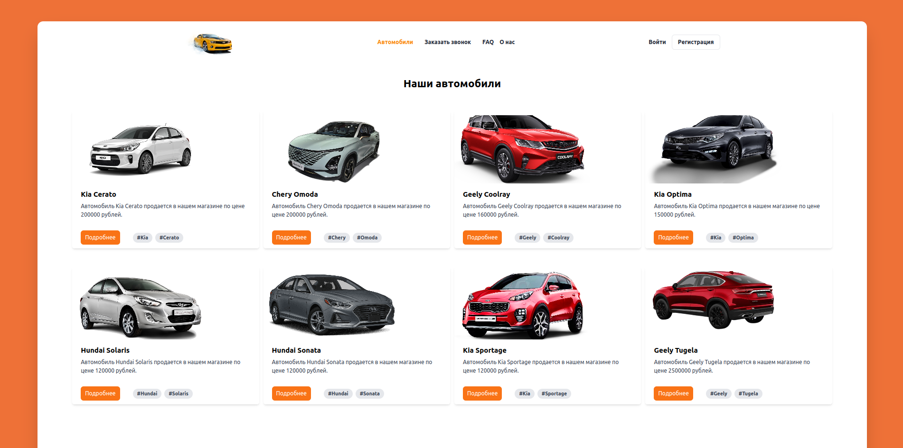
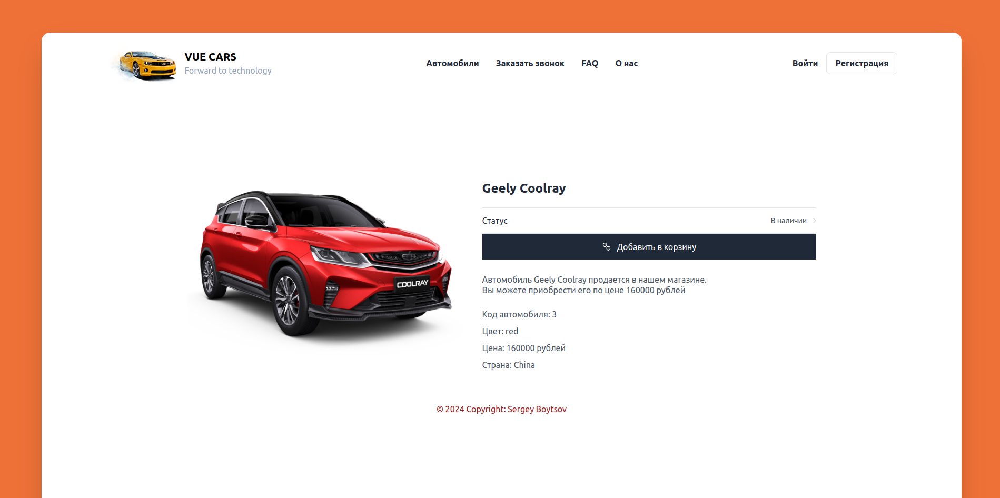

# Car store on vue3 using composition api

## Vehicle detail page

## Recommended IDE Setup

[VSCode](https://code.visualstudio.com/) + [Volar](https://marketplace.visualstudio.com/items?itemName=Vue.volar) (and disable Vetur) + [TypeScript Vue Plugin (Volar)](https://marketplace.visualstudio.com/items?itemName=Vue.vscode-typescript-vue-plugin).

## Technology stack
* Vue3
* CSS
* Html
* JavaScript
* Tailwind
* Pinia
* Router